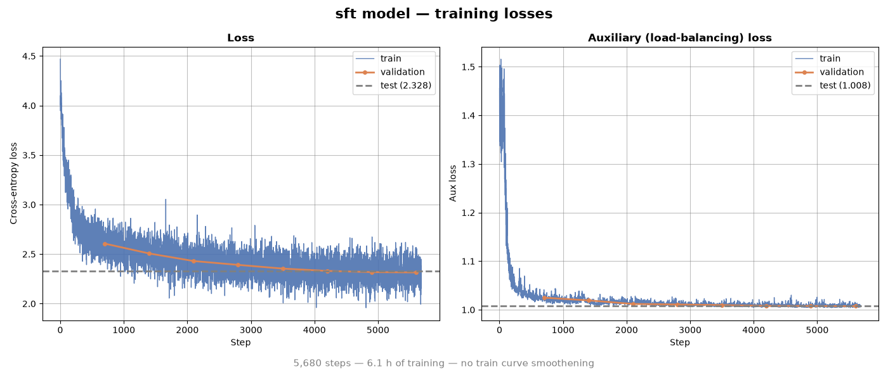
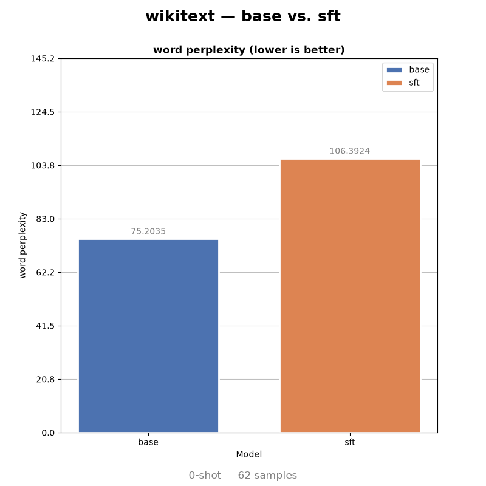
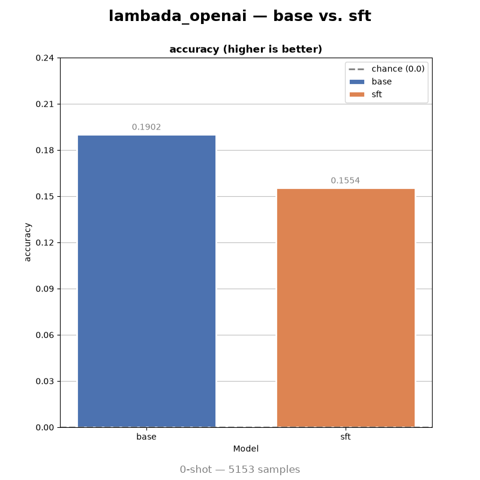
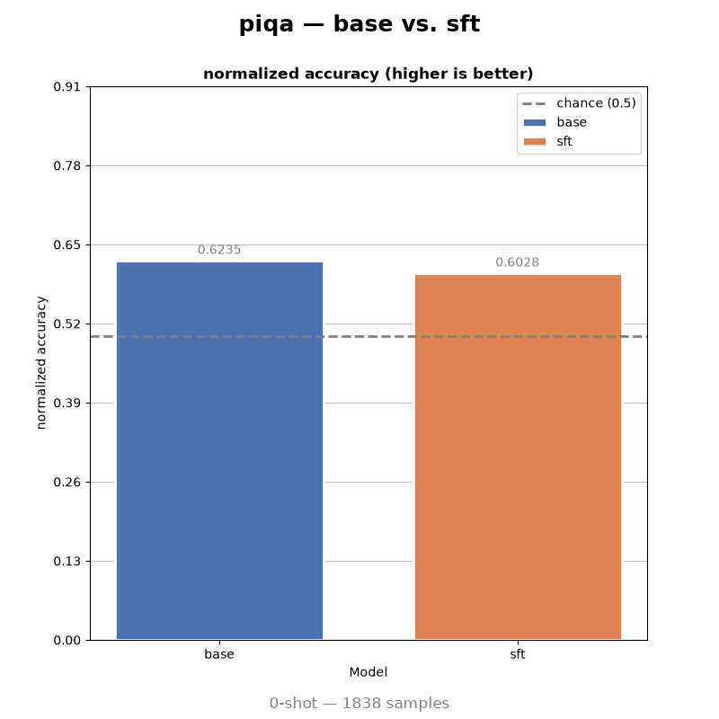
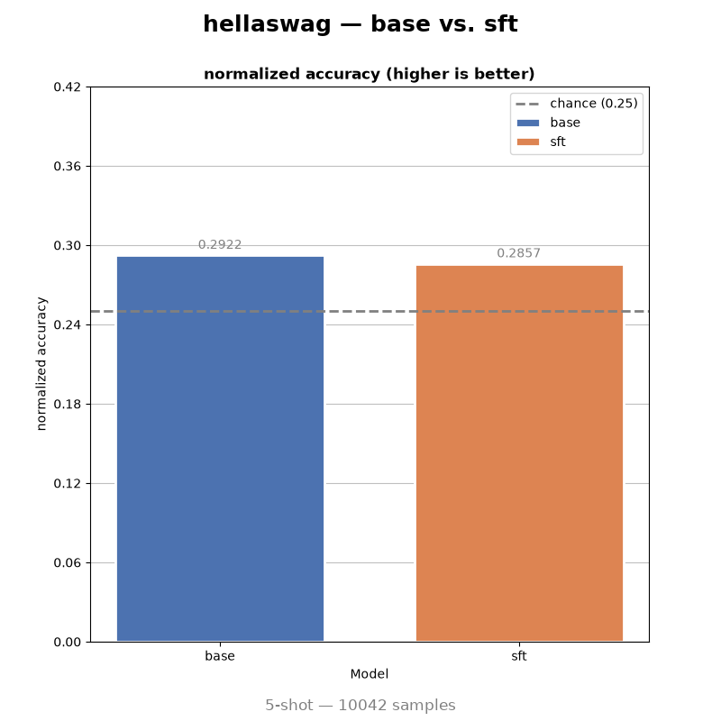
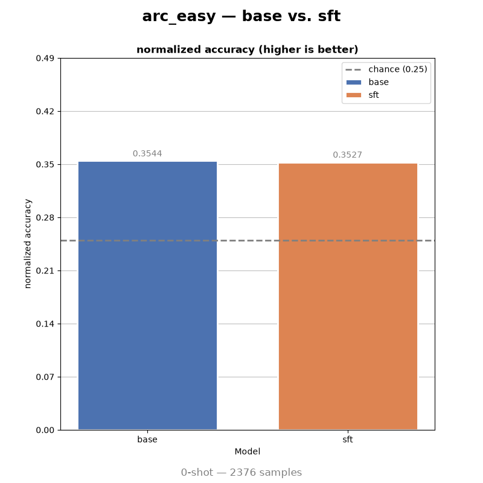
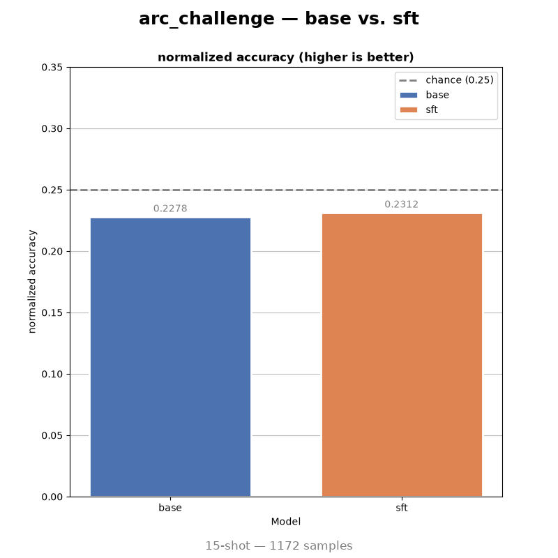
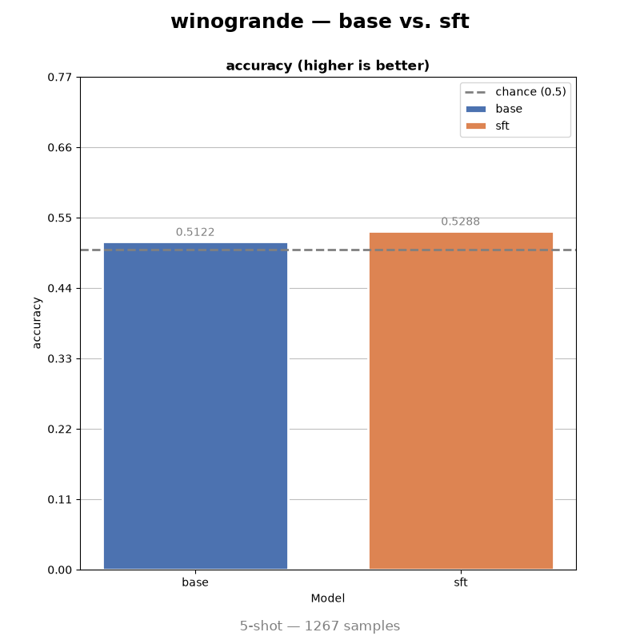
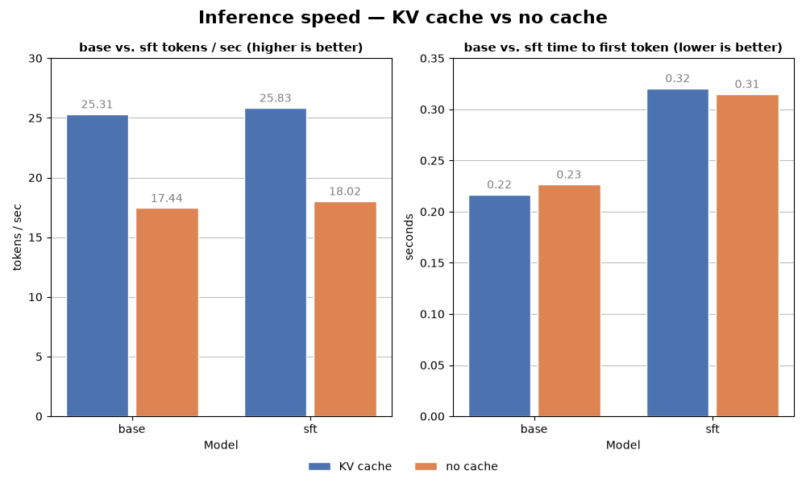

# MoE-Study-Applied


[](LICENSE)

[](https://huggingface.co/OliverSundaram/MoE-Study-Applied)
[](https://github.com/OliverSundaram/MoE-Study)
[](https://github.com/OliverSundaram/MoE-Study-Remastered)

---

## Table of contents

 - [TL;DR](#tldr)
 - [Overview](#overview)
 - [Results](#results)
   - [The behavioural change](#the-behavioural-change)
   - [Loss](#loss)
   - [Benchmarks](#benchmarks)
   - [Speed](#speed)
   - [Where it actually stands](#where-it-actually-stands)
 - [How it was built](#how-it-was-built)
   - [Teaching a base model to stop](#teaching-a-base-model-to-stop)
   - [The KV cache](#the-kv-cache)
 - [Using it](#using-it)
 - [Running it yourself](#running-it-yourself)
 - [Repository structure](#repository-structure)
 - [Citation](#citation)
 - [References](#references)
 - [License](#license)

---

## TL;DR

> SFT (Supervised Fine-tuning) a pretrained model specialized it,
> improving its performance at the specific task — in this case, summarizing BBC articles.

> If you fine-tune a pretrained model without freezing weights, you get a model that specialized
> too well — it performs excellently at the selected task and worse on general language benchmarks.

---

## Overview

A supervised fine-tune of the 201M-parameter sparse Mixture-of-Experts model from
`MoE-Study-Remastered` into an abstractive summarizer. Six hours on a single RTX 4060
and 181,773 BBC article/summary pairs from XSum. This is the third study in the
MoE-Study trilogy, continuing from MoE-Study-Remastered — where the base model was trained.

<details>
<summary><b>Full List of Additions</b></summary>

 - **Supervised fine-tuning:**
`MoE-Study-Remastered` ended at a base model: next-token prediction on web text and no
instruction following of any kind. This study adds the SFT stage, training the model
on formatted prompt/response pairs so it learns to answer in a fixed shape and, more
importantly, to stop generating.

 - **A KV cache:**
In `MoE-Study-Remastered`, `LLM.forward` returned logits and nothing else, so generation
recomputed the entire K and V matrices at every step. That was the single largest reason
the model measured at 17.92 tok/s. `MultiQueryAttention` now registers non-persistent
`k_cache` and `v_cache` buffers, concatenates each step's new keys and values onto them,
and implements a `reset_cache()` function.

 - **A chat template and three special tokens:**
`<|end|>`, `<|user|>` and `<|assistant|>` were added to the 32,768-vocab BPE tokenizer,
taking it to 32,771. `LLM.format_prompt` wraps every prompt as
`<|user|>...<|end|><|assistant|>`, and `<|end|>` becomes the eos token, which is what lets
the fine-tuned model terminate on its own instead of running to `max_new_tokens`. The
extended tokenizer is written straight back into `model/base/`, so every downstream script
picks it up from the checkpoint directory it already loads.

 - **Prompt-masked loss:**
`FTDataset` masks the prompt length and the right padding with `IGNORE_ID = -100` for target_ids,
so cross-entropy is computed on summary tokens only. That leaves 5,104,939 supervised tokens
out of 78,357,978 in the training split.

 - **A built-in `generate`:**
Remastered required hand-writing a sampling loop, because `LLM` subclasses
`PreTrainedModel` without `GenerationMixin`. `LLM.generate` now ships inside `modules.py`.
It applies the chat template, runs the prompt once to fill the cache, then decodes one token
at a time, returning the text along with tokens/sec and time-to-first-token.

 - **Base-vs-fine-tune evaluation:**
Where Remastered benchmarked against an external baseline, this study benchmarks the model
against *itself*: the same seven harness tasks at the same few-shot counts, run on both
checkpoints, so the effect of fine-tuning is the only variable.

</details>

**At a glance**

|                           |                                                                                                     |
|---------------------------|-----------------------------------------------------------------------------------------------------|
| Base checkpoint           | [MoE-Study-Remastered](https://github.com/OliverSundaram/MoE-Study-Remastered)                      |
| Total parameters          | 201,269,248                                                                                         |
| Context length            | 1024                                                                                                |
| Fine-tuning data          | [EdinburghNLP/xsum](https://huggingface.co/datasets/EdinburghNLP/xsum), 181,773 train pairs         |
| Task                      | Abstractive single-sentence summarization                                                           |
| Hardware                  | NVIDIA GeForce RTX 4060, 8GB VRAM                                                                   |
| Fine-tuning time          | 21,844s (6.07 h)                                                                                    |
| Weights                   | [Model](https://huggingface.co/OliverSundaram/MoE-Study-Applied)                                    |

---

## Results

|                                          | base                 | sft                       |
|------------------------------------------|----------------------|---------------------------|
| Test cross-entropy (held-out XSum)       | 3.3070               | **2.3281**                |
| Behaviour on an article                  | never terminates     | **stops after 18 tokens** |

At first glance the fine-tune specialized the model at no cost. The following sections are about what it actually cost.

### The behavioural change

Both checkpoints, one BBC article each, up to 500 tokens, `top_k=50`, `temp=0.8`.

**The base model**, given a piece about England's T20 World Cup squad:

```
', 4.
"It's going to be exciting and exciting," said Stanislav Khurr, who plays for The Daily
Express. "It's going to be very exciting and it's going to be very much looking forward
to the final game."cious has said that he has been disappointed that he didn't want to be
part of the club and was disappointed when they had to return the favour.
"I guess on the road I'm going to be a little bit disappointed. I always thought it was a
good place to play but I've been there for a bit. I've been in my home for four and a
half years. I'm not happy, I'm sad. It's not the right thing for me to do.
[...runs to the full 500 tokens]
```

It never stops, never summarizes, and invents a journalist. It is continuing text, which is
all a base model knows how to do.

**The fine-tuned model**, given a Charlton Athletic transfer roundup that mentions a
season-long loan at Ajax, defender Rod Fanni signing from Al-Arabi, and cancelled contracts
for Franck Moussa and Ricardo Vaz Te:

```
Charlton Athletic have recalled striker Philippe Fanni from fellow side Blackpool on loan.
```

Eighteen tokens, then `<|end|>`, unprompted. Right register, right length, right entity
domain. Also wrong: the surname is lifted off Rod Fanni, "Philippe" is invented outright,
and Blackpool appears nowhere in the article.

**The shape was learned completely. The grounding was not learned at all.**

### Loss

|      | Train  | Val    | Test   |
|------|--------|--------|--------|
| sft  | 2.3194 | 2.3155 | 2.3281 |

> *Train is the mean of the final 100 optimizer steps*



A perfectly balanced 8-expert router sits at exactly 1.0.
The fine-tune tightened to 1.008, so specializing on one
narrow task did not collapse the model onto a narrow subset
of its experts.

### Benchmarks

Seven tasks, lm-evaluation-harness v0.4.13, full splits, batch size 8.
Few-shot counts are inherited from Remastered.
(If you want to know the reasoning for the few-shot counts for each metric, please read `MoE-Study-Remastered`)

| Benchmark       | Shots | Metric          | base   | sft    | Δ      |
|-----------------|-------|-----------------|--------|--------|--------|
| wikitext        | 0     | word_perplexity | 75.20  | 106.39 | +31.19 |
| lambada_openai  | 0     | acc             | 19.02  | 15.54  | −3.48  |
| piqa            | 0     | acc_norm        | 62.35  | 60.28  | −2.07  |
| hellaswag       | 5     | acc_norm        | 29.22  | 28.57  | −0.65  |
| arc_easy        | 0     | acc_norm        | 35.44  | 35.27  | −0.17  |
| arc_challenge   | 15    | acc_norm        | 22.78  | 23.12  | +0.34  |
| winogrande      | 5     | acc             | 51.22  | 52.88  | +1.66  |

Sorted by damage. The top two moved, the bottom five did not.









Wikitext and lambada are pure language modelling: continue this text, predict this final
word. Both are exactly the capability the fine-tune stopped training. This is textbook
catastrophic forgetting, and three decisions made it unavoidable:

1. **Full-parameter SFT.** Every weight moved, including the ones holding general language
modelling.

2. **A single narrow distribution.** XSum is BBC news and one-sentence summaries, with no
replay of pretraining data mixed in. Nothing pulled the model back toward where it started.

3. **Loss masked to the summary span.** The model got gradient only on short, formulaic
sentences and was explicitly *not* trained to model the long input articles. Open-ended
continuation had no reason to survive.

<details>
<summary><b>Secondary metrics</b></summary>

| Benchmark       | Metric          | base    | sft     |
|-----------------|-----------------|---------|---------|
| lambada_openai  | perplexity      | 201.27  | 378.81  |
| wikitext        | byte_perplexity | 2.243   | 2.394   |
| wikitext        | bits_per_byte   | 1.166   | 1.259   |
| arc_easy        | acc             | 37.88   | 37.12   |
| piqa            | acc             | 62.68   | 61.59   |
| hellaswag       | acc             | 27.95   | 27.74   |
| arc_challenge   | acc             | 17.83   | 18.17   |

Full splits throughout: arc_easy 2,376, piqa 1,838, wikitext 62, lambada_openai 5,153,
winogrande 1,267, hellaswag 10,042, arc_challenge 1,172.

</details>

### Speed



Time-to-first-token is flat within each model, as it should be: the first token needs a full
forward pass over the prompt either way, so there is nothing yet to reuse. The gap between the
two rows is prompt length rather than caching, since each run drew its own random document.

### Where it actually stands

**It reliably produces well-formed summaries.** One sentence, newswire register, correct
length, terminated by the model itself. A capability the base model did not have in any form.

**It hallucinates freely.** No faithfulness metric (ROUGE, factual consistency, entity
overlap) was run, so the rate is unmeasured.

**It is worse at everything else.** If you need a general-purpose small model, the base
checkpoint is strictly better and it lives in the other repo.

**It is not a general summarizer.** Every claim here is about XSum, which is BBC news in one
house style. The single-sentence output length is a property of the dataset the model
absorbed, not a switch to turn on/off.

**Most benchmark numbers sit near chance for both checkpoints.** Hellaswag 28.57 against 25.00
chance, arc_challenge 23.12 against 25.00, winogrande 52.88 against 50.00. Only piqa and
arc_easy clear the floor by a real margin.

**What was not tried.** No ablations, so the individual contributions of the cache, chat
template, masking and learning rate are unknown. No parameter-efficient variant to compare
forgetting against. No summarization-specific metric, the most obvious gap. No RLHF.

---

## How it was built

### Teaching a base model to stop

**Vocabulary surgery.** The base tokenizer is Remastered's 32,768-entry BPE, trained for raw
text and with no notion of turn-taking. `edit_tokenizer.ipynb` loads it from `model/base/`,
adds `<|end|>`, `<|user|>` and `<|assistant|>`, promotes `<|end|>` to eos, and saves the
32,771-entry result straight back into `model/base/`. The edit is in place, so the base
checkpoint you downloaded is the one carrying the extended vocabulary, and every downstream
script reads it from there. This step is what makes termination learnable: without a token
meaning *stop*, no amount of training will teach the model to produce one.

**Dataset construction.** `downloading.ipynb` pulls XSum, renders each row as
`<|user|>{article}<|end|><|assistant|>{summary}<|end|>`, tokenizes it, and records where the
prompt ends. Rows are dropped if the result exceeds `context_length + 1` tokens or if the
summary is under 10 tokens.

|                          |                                                                     |
|--------------------------|-----------------------------------------------------------------------|
| Kept                     | 202,015 of 226,711 rows (24,696 dropped, nearly all over-length)     |
| Train / val / test       | 181,773 / 10,113 / 10,129, the dataset's own splits                  |
| Total tokens             | 87,078,111                                                           |
| Supervised tokens        | 5,673,339 (6.5% of the corpus)                                       |

That last row is the important one. `FTDataset` pads with `PAD_ID = 0` and masks *both* the
prompt span and the padding with `IGNORE_ID = -100`, so cross-entropy only ever sees summary
tokens. The model reads 87M tokens and is graded on 5.7M of them, which is what the benchmark
regressions above pay for.

**Training.** One epoch, and the run ends because the data runs out.

|                |                                                    |
|----------------|------------------------------------------------------|
| Optimizer      | AdamW (fused), lr 5e-5                             |
| Schedule       | OneCycleLR, cosine, 3% warmup                      |
| Weight decay   | 0.1 on params with dim >= 2, 0.0 elsewhere         |
| Grad clipping  | 1.0                                                |
| Aux loss scale | 0.01                                               |
| Batch size     | 2 × 16 accum = 32 effective                        |
| Precision      | bfloat16 autocast                                  |
| Steps          | 5,680 optimizer steps (90,886 micro-batches)       |
| Validation     | every 700 steps, 250 batches                       |
| Seed           | 42                                                 |

The learning rate is an order of magnitude below the 6e-4 used for pretraining, the standard
SFT posture. As the results show, 5e-5 across every parameter for a full epoch still moves the
model a long way from where it started.

### The KV cache

Remastered's README lists "No KV cache" under Limitations, and it costs that study a 6.1x
speed gap against its baseline. This study implements a properly designed KV cache within
MultiQueryAttention, which ultimately made a significant jump in speed performance for both
the base and sft models.

---

## Using it

Weights and tokenizer: **[huggingface.co/OliverSundaram/MoE-Study-Applied](https://huggingface.co/OliverSundaram/MoE-Study-Applied)**

Unlike Remastered, you do not have to write your own sampling loop, because `LLM.generate`
ships inside the checkpoint. It is not the Hugging Face `generate`: it takes a raw string,
applies the chat template itself, and returns a
`(text, tokens_per_second, time_to_first_token)` tuple, where `text` is the whole decoded
sequence with the formatted prompt still in it.

```python

import torch
from transformers import AutoModelForCausalLM, AutoTokenizer
from datasets import load_dataset

def get_random_prompt(DATA_DIR, SEED, SPLIT, tokenizer, context_length, max_new_tokens):
    ds = iter(load_dataset(DATA_DIR, split=SPLIT).shuffle(SEED))

    while True:
        prompt = next(ds)["document"]
        formatted_prompt = "<|user|>" + prompt + "<|end|>" + "<|assistant|>"
        ids = tokenizer(formatted_prompt).input_ids
        if len(ids) <= context_length - max_new_tokens:
            break

    return prompt

MODEL = "OliverSundaram/MoE-Study-Applied"  # or a local model/sft
device = torch.device("cuda" if torch.cuda.is_available() else "cpu")

tokenizer = AutoTokenizer.from_pretrained(MODEL)
model = AutoModelForCausalLM.from_pretrained(MODEL, trust_remote_code=True)

# Keeps the embedding table and the special tokens in sync; required for the base checkpoint.
model.resize_token_embeddings(len(tokenizer))
model.config.eos_token_id = tokenizer.eos_token_id
model.config.pad_token_id = tokenizer.pad_token_id
model.to(device).eval()

prompt = get_random_prompt(
    DATA_DIR="EdinburghNLP/xsum",
    SEED=42,
    SPLIT="test",
    tokenizer=tokenizer,
    context_length=model.config.context_length,
    max_new_tokens=100
)

text, tok_per_sec, ttft = model.generate(
    prompt,
    tokenizer,
    device,
    max_new_tokens=100,
    top_k=50,
    temp=0.8,
    use_cached=True,
    print_text=True
)

```

`trust_remote_code=True` is required, because `model_type` is `custom_llm` and the
architecture loads from the `modules.py` shipped inside the checkpoint.

---

## Running it yourself

**Requirements.** An NVIDIA GPU. There is no CPU path for training, and `sft_training.py`
raises `RuntimeError` if CUDA is unavailable. This run used an RTX 4060 8GB and took 6.07h at
roughly 4.16 micro-batches/sec. You also need the base checkpoint from
[MoE-Study-Remastered](https://github.com/OliverSundaram/MoE-Study-Remastered) placed at
`model/base/`, since nothing here trains it, plus about 25GB of disk: 243MB of tokenized
splits and a 2.3GB checkpoint every 700 steps (eight of those, plus `final/`). Delete the
intermediate `step_*/` directories as the run proceeds if that is tight. Python 3.12, CUDA 12.8.

```bash
git clone https://github.com/OliverSundaram/MoE-Study-Applied.git
cd MoE-Study-Applied
python -m venv .venv
.venv\Scripts\activate    # Windows; on Linux/macOS: source .venv/bin/activate
pip install -r requirements.txt --extra-index-url https://download.pytorch.org/whl/cu128
```

The extra index is not optional. `requirements.txt` pins the CUDA 12.8 torch build, which is
not published on PyPI.

```bash
# 1. Add <|end|>, <|user|> and <|assistant|>, editing model/base/ in place.  (seconds)
#    Run this notebook with preparation/ as the working directory.
jupyter notebook preparation/edit_tokenizer.ipynb

# 2. Download XSum, format as chat, tokenize to .pt splits.  (~20 min after download)
jupyter notebook preparation/downloading.ipynb

# 3. Fine-tune, from training/, with the repository root importable.  (6.07h)
cd training; $env:PYTHONPATH=".."; python sft_training.py; cd ..    # PowerShell
# Linux/macOS: cd training && PYTHONPATH=.. python sft_training.py && cd ..

# 4. Evaluate. Run twice, flipping MODEL_NAME between "base" and "sft".  (~30 min each)
cd evaluation; python run_eval.py

# 5. Speed. Four runs: MODEL in {"base","sft"} × USE_CACHED in {True, False}.  (~2 min each)
python benchmark_speed.py

# 6. Charts. plot_losses.py takes the same MODEL_NAME switch as step 4.  (seconds)
python plot_losses.py
python plot_eval.py
python plot_speed.py
```

---

## Repository structure

```text

MoE-Study-Applied/
│
├── preparation/                # Dataset and tokenizer pipeline
│   ├── edit_tokenizer.ipynb    # Adds <|end|>, <|user|>, <|assistant|>; edits model/base/
│   ├── downloading.ipynb       # Downloads XSum, formats as chat, tokenizes to .pt splits
│   ├── dataset.py              # FTDataset: padding, prompt masking, get_dataset(split)
│   └── data/                   # {train,val,test}.pt                 (generated, git-ignored)
│
├── training/
│   ├── sft_training.py         # Entry point: hyperparameters, model/optimizer/scheduler/loaders
│   └── trainer.py              # Trainer.train(): grad accumulation, periodic validation,
│                               #   checkpointing, final test pass
│
├── evaluation/
│   ├── run_eval.py             # lm-evaluation-harness run (arc_easy, piqa, wikitext,
│   │                           #   lambada_openai, winogrande, hellaswag, arc_challenge)
│   │                           #   at 0/5/15 shots
│   ├── benchmark_speed.py      # tok/s and TTFT on a random XSum document, cached vs uncached
│   ├── plot_losses.py          # Train/val loss and aux-loss curves from trainer_state.pt
│   ├── plot_eval.py            # Per-benchmark base-vs-sft comparison charts
│   ├── plot_speed.py           # KV cache vs no cache speed chart
│   ├── results/                # Harness output JSON (committed) + speed tensors (ignored)
│   └── assets/                 # Generated PNG charts
│
├── model/                      # Checkpoints, each with config.json, model.safetensors,
│   ├── base/                   #   tokenizer, modules.py and trainer_state.pt
│   └── sft/                    #   base/ comes from MoE-Study-Remastered  (git-ignored)
│
├── runs/                       # Checkpoints written during fine-tuning: step_*/ and final/
│                               #   (generated, git-ignored)
│
├── .gitignore
├── requirements.txt
├── LICENSE
└── README.md

```

The architecture lives in `modules.py`, shipped inside each checkpoint directory rather than
as a top-level package. That is what `auto_map` in `config.json` points at, and why
`trust_remote_code=True` is needed to load either model.

---

## Citation

```bibtex
@misc{moe-study-applied,
  author       = {Oliver Sundaram},
  title        = {MoE-Study-Applied: Supervised Fine-Tuning a Sparse Mixture-of-Experts Language Model for Abstractive Summarization},
  year         = {2026},
  publisher    = {GitHub},
  howpublished = {\url{https://github.com/OliverSundaram/MoE-Study-Applied}}
}
```

---

## References

- **[MoE-Study-Remastered](https://github.com/OliverSundaram/MoE-Study-Remastered)**: the pretrained base checkpoint and the architecture this study fine-tunes.
- **[EdinburghNLP/xsum](https://huggingface.co/datasets/EdinburghNLP/xsum)**: fine-tuning corpus.
- **[lm-evaluation-harness](https://github.com/EleutherAI/lm-evaluation-harness)**: evaluation framework behind every benchmark score above.
- **[Training language models to follow instructions with human feedback](https://arxiv.org/abs/2203.02155)**: the InstructGPT paper, source of the supervised fine-tuning stage this study implements.
- **[Fast Transformer Decoding: One Write-Head is All You Need](https://arxiv.org/abs/1911.02150)**: Multi-Query Attention, which is what makes the KV cache added here cheap to hold.
- **[RoFormer: Enhanced Transformer with Rotary Position Embedding](https://arxiv.org/abs/2104.09864)**: RoPE, extended here with a cache-aware position offset.
- **[GLU Variants Improve Transformer](https://arxiv.org/abs/2002.05202)**: SwiGLU, used in the expert FFNs.
- **[Root Mean Square Layer Normalization](https://arxiv.org/abs/1910.07467)**: RMSNorm.
- **[Outrageously Large Neural Networks: The Sparsely-Gated Mixture-of-Experts Layer](https://arxiv.org/abs/1701.06538)**: origin of the sparsely-gated top-k MoE layer.
- **[Switch Transformers](https://arxiv.org/abs/2101.03961)**: the auxiliary load-balancing loss formulation used here.
- **[Hugging Face Transformers](https://github.com/huggingface/transformers)**: `PreTrainedModel` and `PretrainedConfig`, tokenizer utilities, and the tooling around the model.
- **[PyTorch](https://pytorch.org/)**: training and model implementation.
- **[Instruction Finetuning](https://www.youtube.com/watch?v=4yNswvhPWCQ&t=1201s)**: foundational knowledge for finetuning.

---

## License

MIT — see [LICENSE](LICENSE).